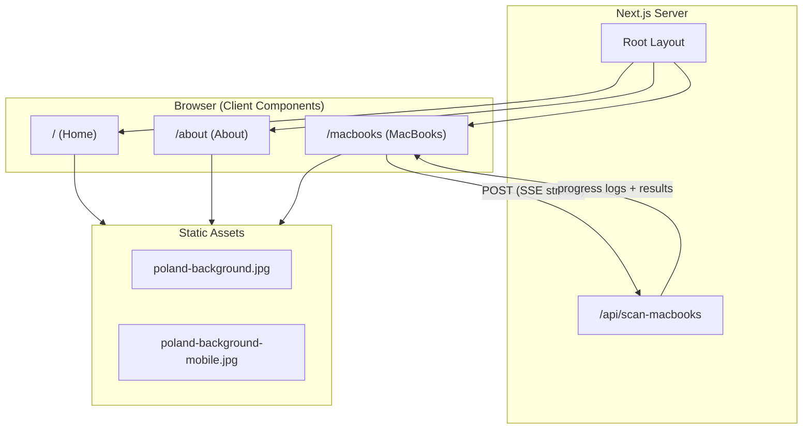
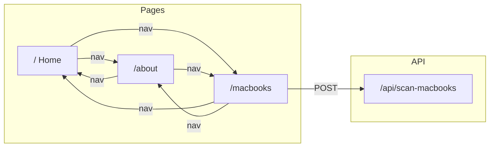
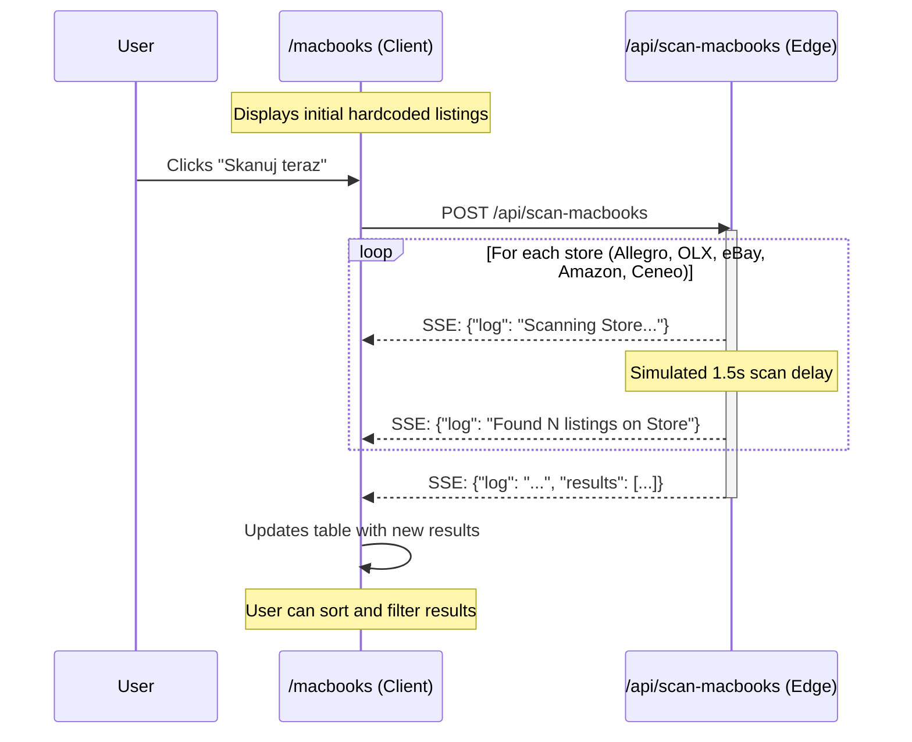
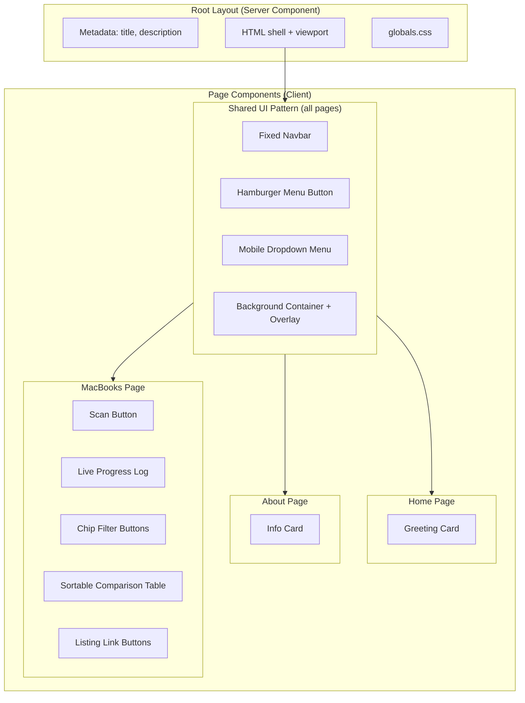

# Architecture

## High-Level Overview



## Route Map



## Directory Structure

```
meflan/
├── app/
│   ├── layout.tsx              # Root layout (metadata, global HTML shell)
│   ├── page.tsx                # Home page
│   ├── globals.css             # Global styles + responsive background
│   ├── about/
│   │   └── page.tsx            # About page
│   ├── macbooks/
│   │   └── page.tsx            # MacBooks comparison page
│   └── api/
│       └── scan-macbooks/
│           └── route.ts        # SSE streaming API endpoint (Edge runtime)
├── public/
│   ├── poland-background.jpg       # Desktop background
│   └── poland-background-mobile.jpg # Mobile background
├── package.json
├── tsconfig.json
└── docs/
    ├── architecture.md         # This file
    └── context.md              # Project context and features
```

## Data Flow: MacBook Scanning



## Component Architecture



## Technology Stack

| Layer | Technology | Version |
|-------|-----------|---------|
| Framework | Next.js (App Router) | 16.1.6 |
| UI | React | 19.0.0 |
| Language | TypeScript | 5.9.3 |
| Styling | Inline styles + globals.css | - |
| API Runtime | Edge (Vercel Edge Functions) | - |
| Streaming | Server-Sent Events (SSE) | - |

## Key Architectural Decisions

- **App Router** over Pages Router for modern file-based routing
- **Client Components** (`'use client'`) for all pages due to interactive state
- **Edge Runtime** for the scan API to enable low-latency streaming
- **Inline styles** instead of CSS modules or Tailwind for simplicity
- **No external UI libraries** to keep the bundle minimal
- **SSE streaming** for real-time scan progress instead of polling or WebSockets
- **Local component state** (`useState`) instead of global state management
